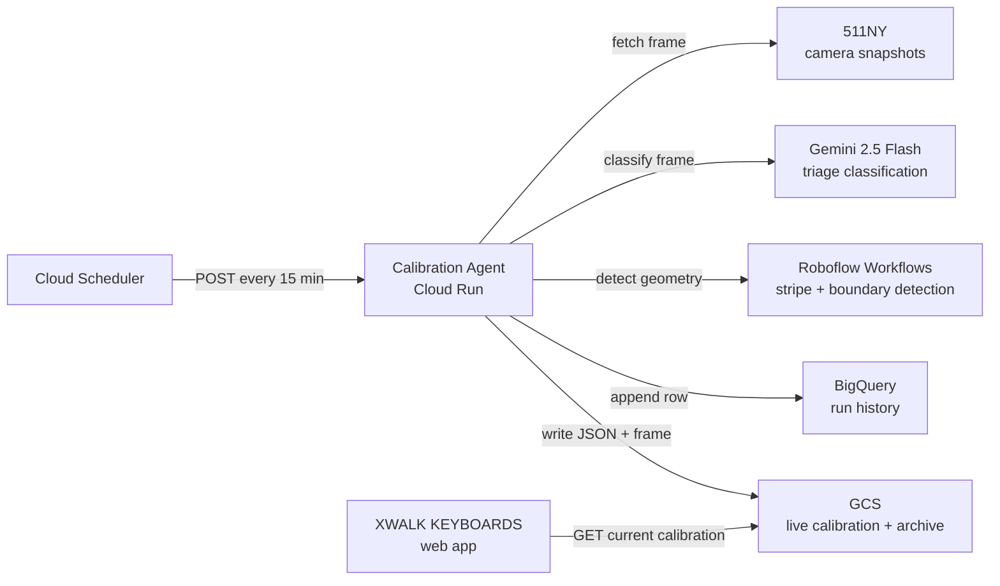

# XWALK Camera Calibration Agent — Technical Architecture

## Purpose and scope

This document defines the production architecture for the **XWALK Camera
Calibration Agent**. It is the implementation contract for the service that
keeps [XWALK KEYBOARDS](https://github.com/vinceallenvince/xwalk-keyboards)
stripe geometry aligned with the painted crosswalk as traffic cameras drift
from wind, thermal expansion, and occasional re-aims.

The service has one job: detect where the crosswalk stripes are in the current
camera frame, and publish their positions so the web app's keyboard stays on
the paint.

The architecture is designed around three non-negotiable properties:

1. **Camera-agnostic geometry.** The production path holds no reference
   calibration, expects no particular number of stripes, and emits no note
   names. Pointing it at a new camera needs no hand-authored geometry.
2. **Deterministic orchestration.** There is no reasoning-loop agent. The
   pipeline is linear Python code in `main.py` — Gemini classifies, Roboflow
   detects, code places. The only LLM prompt in the system is the triage
   instruction in `tools.py`.
3. **Partial reads are correct reads.** A frame with six visible stripes
   publishes six stripes, not zero. Each stripe carries its own position; the
   client renders what it is given without needing a complete set.

## System overview

### High-level system diagram

```text
+-----------------------------+
| Cloud Scheduler             |
| one job per camera,         |
| every 15 min                |
+-------------+---------------+
              |
              | POST /api/calibrate-scheduled?cameraId=NNNN
              v
+------------------------------------------+
| Calibration Agent (Cloud Run)            |
| FastAPI service                          |
|                                          |
| main.py: deterministic pipeline          |
|   1. Gemini Flash triage                 |
|   2. Roboflow boundary detection         |
|   3. Roboflow stripe detection           |
|   4. Geometry placement + continuity     |
|   5. Persist to BigQuery + GCS           |
+-----+------------------+----------------+
      |                  |
      v                  v
+------------+  +---------------------+
| 511NY      |  | Roboflow Workflows  |
| camera     |  | stripe segmentation |
| snapshots  |  | boundary detection  |
+------------+  +---------------------+

Persistence
───────────
Agent → BigQuery: one row per run (Looker Studio source)
Agent → GCS history: JSON record + source frame (every run)
Agent → GCS current: live calibration JSON (publish runs only)
GCS current → XWALK KEYBOARDS web app: page-load fetch
```



The agent fetches a camera snapshot, asks Gemini whether the crosswalk is
visible, and if so runs two Roboflow workflows — one for crosswalk boundaries,
one for stripe polygons. Code places each stripe along its crosswalk, and
persistence writes the result to BigQuery (for dashboards) and GCS (for the
web client).

## Pipeline stages

### Stage 1: Gemini Flash triage

**Module:** `app/tools.py` — `analyse_conditions()`

Gemini 2.5 Flash classifies the camera frame against the camera's registered
scene description. It returns four fields:

| Field | Purpose |
| --- | --- |
| `status` | Gate decision: `ok`, `degraded`, `no_crosswalk`, `feed_down` |
| `conditions` | Structured classification: `occlusion` + `visibility` + `cameraMoved` + `repaintSuspected` |
| `reasoning` | Free-text explanation for operators, max 250 characters |
| `confidence` | 0.0–1.0 self-assessed confidence |

If `status` is `no_crosswalk` or `feed_down`, the run stops — no point calling
Roboflow on a blank frame or an outage placeholder.

The triage prompt is per-camera: the scene description comes from
`app/cameras.py`, so a new camera is judged against its own scene rather than
against View 5056's bollard median. An unregistered camera gets a generic
prompt and still calibrates.

**Conditions axes.** `occlusion` (what is physically covering the paint) and
`visibility` (the lighting or atmospheric factor reducing contrast) are
separate fields because they fail differently: an occluded stripe is hidden
from any model, while low-contrast light quietly degrades detection recall. A
week of run history showed dusk and late-day tree shadows cost more stripes
than parked vehicles, while a streetlit night detects best of all — so the
schema distinguishes `dusk` from `dark`, and neither is folded into an
"obstruction."

**Why Flash, not Pro.** The triage call does not need grounding precision — it
needs to classify a frame and produce a short explanation. Flash is fast, cheap,
and well suited to classification. The geometry work that needs precision is
Roboflow's job.

### Stage 2: Roboflow boundary detection

**Module:** `app/tools.py` — `detect_boundaries()`

A Roboflow serverless workflow returns the crosswalk outline polygons. These
are named by their left-to-right order in the frame (`left`, `right`, then
`segment3`, `segment4`…), so nothing depends on where a particular camera's
crosswalks sit.

Boundaries serve two purposes in the stripe pass:

- **Origin.** The boundary's leading edge is the origin from which stripe
  positions are measured, and it does not move when leading stripes are hidden.
- **Partition.** When the gap between crosswalks is occluded, the boundary
  polygons tell the stripe pass which crosswalk each detection belongs to.

**Boundary cap.** When a camera's registered crosswalk count is known
(`expected_crosswalks` on `CameraConfig`), `largest_boundaries()` drops
fragments beyond that count. Occlusion can split one crosswalk into multiple
detected boundaries — a truck parked mid-crosswalk leaves two disconnected
patches of paint, and each becomes its own detection. Without the cap, a
fragment gets published as a phantom segment that boundary continuity then
demands on every later run.

### Stage 3: Segment continuity

**Module:** `app/continuity.py` — `reconcile_segments()`

The web client maps segment names to fixed pitch anchors. A segment name that
drifts between runs transposes a whole keyboard. This module provides temporal
memory: detected boundaries are matched to the previously published calibration
by bounding-box IoU, matched boundaries adopt their previous segment names, and
the disappearance of a previously known crosswalk is reported as a regression
so the caller can hold the last good publish.

The continuity check produces three signals:

| Signal | Meaning |
| --- | --- |
| `renamed` | A detected boundary was matched to a previous segment with a different positional name — it adopts the previous name |
| `missing` | Previous segment names that went unmatched this run |
| `regression` | A previously published crosswalk was not found — the caller holds the previous publish instead of overwriting it |
| `retired` | Previous segments dropped from the baseline because they exceed the camera's registered crosswalk count — phantoms from an occlusion-split, published before the detection cap existed |

The registered crosswalk count bounds the **baseline** exactly as it bounds
detections. A phantom segment in the published calibration can never be
matched by a capped detection pass, so counting its absence as missing would
hold every future publish — the baseline would defend the phantom forever.
Retirement keeps the largest `expected_crosswalks` baseline boundaries (a
fragment is always smaller than the crosswalk it broke off of) and lets the
run publish.

### Stage 4: Roboflow stripe detection + geometry placement

**Modules:** `app/tools.py` — `detect_stripes()`, `app/geometry.py`

A second Roboflow workflow returns paint-accurate instance-segmentation
polygons for each visible stripe. The geometry module assigns each stripe a
`stripeIndex`: its slot position along the crosswalk, measured from the
boundary's leading edge in units of the stripe pitch.

The heuristic in one pass: flatten each stripe polygon to its centroid, project
the centroids onto the crosswalk's principal axis, take the median gap between
neighbours as the pitch, count pitches from the boundary's leading edge,
subtract the shared phase, and round to the nearest slot.

Two properties make the index usable as a stable identity:

- The origin comes from the **boundary**, not from the detections, so a stripe
  keeps its index when a vehicle hides its neighbours.
- The pitch is the **median** gap between detections, so it survives missing
  stripes — one absent bar makes a single double-width gap, and the median
  ignores it.

**Known limit.** If the boundary changes by a whole stripe pitch, every index
shifts by one — genuinely indistinguishable from a crosswalk with one more bar
at its leading edge. Sub-pitch noise, the realistic case, is cancelled by
phase-snapping to the detections' own lattice.

Gaps in the index sequence are meaningful: they are stripes the model could not
see in that frame.

### Stage 5: Persistence

**Module:** `app/persist.py`

Every run writes to three stores:

| Store | What | When |
| --- | --- | --- |
| BigQuery `xwalk-keyboards-01.calibration.runs` | One row per run: status, conditions, reasoning, stripe data, timing, token usage | Every run |
| GCS `calibration/history/camera_NNNN/<runId>.json` + `.png` | Full JSON record and the source frame | Every run |
| GCS `calibration/current/camera_NNNN.json` | The live calibration the web client reads | Publish runs only |

A run publishes when it detected at least one stripe and there is no boundary-
continuity regression. Runs that publish nothing are still recorded in BigQuery
and archived to GCS history, leaving the live calibration untouched.

## Deployment unit

### Cloud Run service: `xwalk-camera-calibration-agent`

A single FastAPI service in `us-central1`, project `xwalk-keyboards-01`. The
Dockerfile uses `uv sync --no-dev` to exclude test dependencies from the
runtime image.

| Route | Auth | Purpose |
| --- | --- | --- |
| `GET /health` | None | Health check |
| `POST /api/calibrate` | API key | Multipart frame upload → full calibration record |
| `POST /api/calibrate-scheduled` | API key | Fetches a frame from the camera's snapshot source, then calibrates. `?cameraId=NNNN` selects the camera |

Authentication is via the `X-API-Key` header when `CALIBRATION_AGENT_API_KEY`
is set. The web app authenticates using a GCP identity token (Cloud Run IAM).

Cloud Scheduler fires one job per camera, addressing each with its `cameraId`
query parameter. The 15-minute cadence gives ~96 runs/day per camera.

## Camera registry

**Module:** `app/cameras.py`

The pipeline is camera-agnostic, but two things genuinely differ per camera:
where to fetch a frame from, and what the scene should look like.

```python
@dataclass(frozen=True)
class CameraConfig:
    camera_id: int
    name: str                           # human-readable, used in the triage prompt
    scene: str                          # what the frame should show when normal
    snapshot_url: str | None = None     # explicit source; 511NY cameras omit this
    expected_crosswalks: int | None = None  # hard cap on published boundaries
    boundary_min_confidence: float | None = None  # per-camera detection bar
```

Cameras on 511NY need no `snapshot_url` — the template
`https://511ny.org/map/Cctv/{camera_id}` derives it from the ID. An
unregistered camera still calibrates with a generic triage prompt and no
crosswalk cap; registering it sharpens the triage.

Currently registered: **View 5056** (West Street at W. 34 St, Manhattan),
two crosswalks separated by a bollard median; and **View 5072** (West Street
at Chambers St, Manhattan), two crosswalks separated by a planted median,
with a lowered `boundary_min_confidence` — the zero-shot boundary model
reads that wider view at 0.55–0.79 even in good light.

## Status model

| Status | Meaning | Publishes? |
| --- | --- | --- |
| `ok` | Crosswalks clearly visible, normal conditions | ✓ |
| `degraded` | Visible but conditions reduced — occlusion, shadows, dusk, glare, or a view that no longer matches the scene | ✓ |
| `no_crosswalk` | No painted crosswalk visible at all | ✗ |
| `feed_down` | Source outage (placeholder image) | ✗ |

There is no `needs_review` status. A repositioned camera or re-striped paint is
not an emergency in a camera-agnostic pipeline — the next run measures the new
scene, with segment continuity guarding against renames. A re-aimed camera with
paint still visible reports `degraded` with `cameraMoved: "significant"`, never
`no_crosswalk`.

Publishing is gated on **detection, not classification.** Gemini has already
rejected frames with no crosswalk, so any stripes Roboflow returns describe
real paint. The one exception is a boundary-continuity regression: publishing a
run that lost a previously published crosswalk would rename segments under the
client, so those runs are archived but never promoted to `current/`.

## Canonical data shapes

### Published calibration (GCS `current/`)

The web client reads one JSON file per camera on page load:

```
gs://xwalk-keyboards-01/calibration/current/camera_5056.json
```

```jsonc
{
  "cameraId": 5056,
  "updatedAt": "2026-08-16T14:30:00Z",
  "status": "ok",
  "conditions": {
    "crosswalkVisible": true,
    "occlusion": "none",
    "visibility": "clear",
    "cameraMoved": "none",
    "repaintSuspected": false
  },
  "referenceFrame": { "width": 352, "height": 240 },
  "crosswalks": {
    "left": [[x, y], ...],
    "right": [[x, y], ...]
  },
  "leftCrosswalk": [[x, y], ...],   // flattened alias for older readers
  "rightCrosswalk": [[x, y], ...],  // flattened alias for older readers
  "stripes": [
    {
      "stripeIndex": 7,
      "segment": "left",
      "polygon": [[x, y], ...],
      "confidence": 0.93
    }
  ]
}
```

Only detected stripes appear; there are no placeholder entries. The
`referenceFrame` gives the frame dimensions these coordinates were measured in;
consumers scale from it. The `crosswalks` map is the forward schema; the
flattened `leftCrosswalk`/`rightCrosswalk` aliases remain for older readers.

### Stripe identity contract

Each stripe carries a `stripeIndex` and a `segment`. Together they form the
stripe's identity. Notes are deliberately absent — the agent reports where the
paint is, and the client owns the mapping from index to pitch. This is the
boundary between the calibration service and the musical instrument.

The web app (see `SCALE_BY_SEGMENT` in `src/lib/use-calibration.ts` in
xwalk-keyboards) maps segment names to pitch anchors and stripe indexes to
notes. A segment name that drifts between runs transposes a keyboard; an index
that shifts silently remaps a key to the wrong note. Both the continuity module
and the phase-snapping geometry protect against those failures.

## Why two models, not one

- **Roboflow cannot reason.** It returns polygons and confidence scores, but
  cannot explain why a stripe is missing or detect conditions outside its
  training set (snow, glare, a re-aim). The status field needs language.
- **Gemini cannot ground precisely.** Every VLM tested — Gemini 2.5 Pro,
  Sol 5.6, Gemini 3.1 Pro — produced geometry measurably worse than Roboflow's
  purpose-trained segmentation model. Using it for geometry was the wrong tool.
- **Gemini-first is a cost gate.** If the feed is down or the crosswalk is
  gone, skipping Roboflow saves the detection call entirely. At 96 runs/day
  this is negligible, but it is architecturally clean: do not run detection on
  frames that cannot produce calibration.

## Persistence stores

### BigQuery — historical record

One row per run in `xwalk-keyboards-01.calibration.runs`. This is the Looker
Studio data source for operational dashboards: camera health timeline, drift
charts, conditions breakdown, reasoning log.

The query pattern is analytical (time-series, aggregation, filtering by
status/conditions over weeks of data), not transactional. BigQuery is
serverless and pay-per-query at this volume.

### GCS — live calibration and archive

Two paths per camera:

| Path | Access | Purpose |
| --- | --- | --- |
| `calibration/current/camera_NNNN.json` | Web client on page load (via Next.js route), every 5 min for long sessions | The live calibration: overwritten atomically on each publish |
| `calibration/history/camera_NNNN/<runId>.json` + `.png` | Operators, offline analysis, `tests/overlay.py` | Complete archive: every run's record and its source frame |

GCS is the right store for the live read: millisecond latency, no connection
pooling, no always-on instance, and object versioning gives rollback. BigQuery
is not a good live-read store — query latency is seconds and the pricing model
penalises frequent small reads.

## Module dependency graph

```text
main.py
  ├── cameras.py          camera registry and config
  ├── tools.py            Gemini triage + Roboflow detection
  │     └── geometry.py   stripe placement (axis, pitch, indexing)
  ├── continuity.py       segment name stability across runs
  ├── persist.py          BigQuery + GCS writes
  └── coords.py           image size sniffing (PNG/JPEG header parsing)
```

`geometry.py` is pure math with no network or I/O dependencies.
`continuity.py` is pure matching logic with no imports outside the standard
library. Both are thoroughly unit-tested.

## Adding a camera

The pipeline is camera-agnostic; onboarding a camera is configuration:

1. **Register it** in `app/cameras.py` — camera ID, human-readable name, a
   one-sentence scene description, and `expected_crosswalks`. The scene
   description is the yardstick the triage prompt judges frames against.
2. **Schedule it** — create a Cloud Scheduler job targeting
   `/api/calibrate-scheduled?cameraId=NNNN`.
3. **Wire the client** — add the camera to `LIVE_CAMERAS` in xwalk-keyboards
   (stream URL, segment anchors, reference calibration).

An unregistered camera still calibrates with no code change — registering it
sharpens the triage and caps the boundary count.

## Observability

The BigQuery table directly supports these Looker Studio views:

| View | What it shows |
| --- | --- |
| Camera health timeline | Status over time, coloured by ok/degraded/no_crosswalk/feed_down |
| Drift chart | Stripe count and confidence over time — a sudden drop signals a problem before it reaches the web client |
| Conditions breakdown | Occlusion and visibility frequency — how often are shadows, dusk, vehicles, or weather hurting detection? |
| Reasoning log | The last N Gemini explanations, filterable by status |
| Detection latency | `elapsed_ms` over time, split by whether Roboflow was called or skipped |

Every run also archives its source frame to GCS history, so any anomaly can be
replayed with `tests/overlay.py` — which draws the archived run's polygons
over the source frame for eyeball checks.

## Environment variables

| Variable | Default | Description |
| --- | --- | --- |
| `CALIBRATION_TRIAGE_MODEL` | `gemini-2.5-flash` | Gemini model for conditions triage |
| `ROBOFLOW_API_KEY` | — | Roboflow API key |
| `CALIBRATION_STRIPE_WORKFLOW_URL` | Roboflow serverless URL | Stripe detection workflow |
| `CALIBRATION_BOUNDARY_WORKFLOW_URL` | Roboflow serverless URL | Boundary detection workflow |
| `CALIBRATION_CAMERA_ID` | `5056` | Default camera for scheduled runs without `?cameraId` |
| `CALIBRATION_SNAPSHOT_URL_TEMPLATE` | `https://511ny.org/map/Cctv/{camera_id}` | Snapshot URL pattern |
| `CALIBRATION_AGENT_API_KEY` | — | API key for request authentication |
| `CALIBRATION_BUCKET` | `xwalk-keyboards-01` | GCS bucket |
| `CALIBRATION_BQ_TABLE` | `xwalk-keyboards-01.calibration.runs` | BigQuery table |
| `GOOGLE_CLOUD_PROJECT` | `xwalk-keyboards-01` | GCP project ID |
| `GOOGLE_CLOUD_LOCATION` | `us-central1` | Vertex AI region |

Keep all keys in Secret Manager for Cloud Run deployments.

## Verification

Unit tests cover:

- **geometry** — stripe placement under occlusion and boundary jitter, pitch
  estimation from sparse detections, phase-snapping stability
- **continuity** — segment names survive occlusion and detection gaps, missing
  segments trigger a regression hold, new cameras pass through untouched
- **cameras** — registered cameras carry their scene and crosswalk count,
  unregistered cameras get generic defaults, triage prompt specialization
- **boundaries** — capping at the registered crosswalk count, fragment dropping,
  survivor re-sorting by position

The triage prompt has assertion-level tests for its contract: status enum
completeness, occlusion/visibility separation, dusk/shadow vocabulary, the
streetlit-night rule, and the re-aim-with-visible-paint routing.
