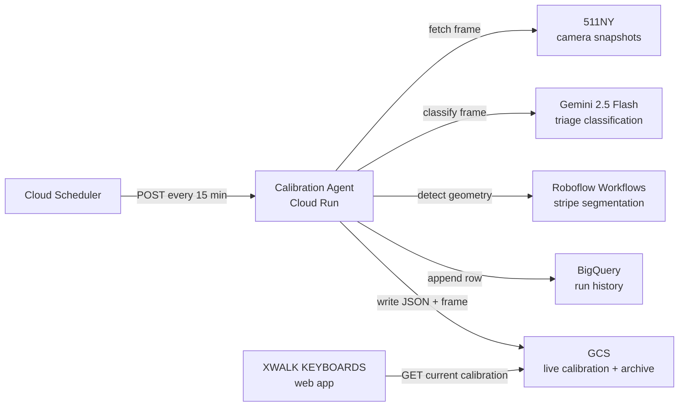

# XWALK Camera Calibration Agent — Technical Architecture

## Purpose and scope

This document defines the production architecture for the **XWALK Camera
Calibration Agent**. It is the implementation contract for the service that
keeps [XWALK KEYBOARDS](https://github.com/vinceallenvince/xwalk-keyboards)
stripe geometry aligned with the painted crosswalk as traffic cameras drift
from wind, thermal expansion, and occasional re-aims.

The service has one job: detect where the crosswalk stripes are in the current
camera frame, and publish their positions so the web app's keyboard stays on
the paint.

The architecture is designed around three non-negotiable properties:

1. **Camera-agnostic geometry.** The production path holds no reference
   calibration, expects no particular number of stripes, and emits no note
   names. Pointing it at a new camera needs no hand-authored geometry.
2. **Deterministic orchestration.** There is no reasoning-loop agent. The
   pipeline is linear Python code in `main.py` — Gemini classifies, Roboflow
   detects, code places. The only LLM prompt in the system is the triage
   instruction in `tools.py`.
3. **Partial reads are correct reads.** A frame with six visible stripes
   publishes six stripes, not zero. Each stripe carries its own position; the
   client renders what it is given without needing a complete set.
4. **No memory between runs.** Every run derives its segments and indexes from
   that frame's detections alone. Identities are therefore allowed to drift —
   see "Stripe identity" below for why that is a feature and not an oversight.

## System overview

### High-level system diagram

```text
+-----------------------------+
| Cloud Scheduler             |
| one job per camera,         |
| every 15 min                |
+-------------+---------------+
              |
              | POST /api/calibrate-scheduled?cameraId=NNNN
              v
+------------------------------------------+
| Calibration Agent (Cloud Run)            |
| FastAPI service                          |
|                                          |
| main.py: deterministic pipeline          |
|   1. Gemini Flash triage                 |
|   2. Roboflow stripe detection           |
|   3. Geometry: cluster + index           |
|   4. Persist to BigQuery + GCS           |
+-----+------------------+----------------+
      |                  |
      v                  v
+------------+  +---------------------+
| 511NY      |  | Roboflow Workflows  |
| camera     |  | stripe segmentation |
| snapshots  |  |                     |
+------------+  +---------------------+

Persistence
───────────
Agent → BigQuery: one row per run (Looker Studio source)
Agent → GCS history: JSON record + source frame (every run)
Agent → GCS current: live calibration JSON (publish runs only)
GCS current → XWALK KEYBOARDS web app: page-load fetch
```



The agent fetches a camera snapshot, asks Gemini whether the crosswalk is
visible, and if so runs one Roboflow workflow for stripe polygons. Code groups
those stripes into crosswalk segments and indexes each one, and persistence
writes the result to BigQuery (for dashboards) and GCS (for the web client).

## Pipeline stages

### Stage 1: Gemini Flash triage

**Module:** `app/tools.py` — `analyse_conditions()`

Gemini 2.5 Flash classifies the camera frame against the camera's registered
scene description. It returns four fields:

| Field | Purpose |
| --- | --- |
| `status` | Gate decision: `ok`, `degraded`, `no_crosswalk`, `feed_down` |
| `conditions` | Structured classification: `occlusion` + `visibility` + `cameraMoved` + `repaintSuspected` |
| `reasoning` | Free-text explanation for operators, max 250 characters |
| `confidence` | 0.0–1.0 self-assessed confidence |

If `status` is `no_crosswalk` or `feed_down`, the run stops — no point calling
Roboflow on a blank frame or an outage placeholder.

The triage prompt is per-camera: the scene description comes from
`app/cameras.py`, so a new camera is judged against its own scene rather than
against View 5056's bollard median. An unregistered camera gets a generic
prompt and still calibrates.

**Conditions axes.** `occlusion` (what is physically covering the paint) and
`visibility` (the lighting or atmospheric factor reducing contrast) are
separate fields because they fail differently: an occluded stripe is hidden
from any model, while low-contrast light quietly degrades detection recall. A
week of run history showed dusk and late-day tree shadows cost more stripes
than parked vehicles, while a streetlit night detects best of all — so the
schema distinguishes `dusk` from `dark`, and neither is folded into an
"obstruction."

**Why Flash, not Pro.** The triage call does not need grounding precision — it
needs to classify a frame and produce a short explanation. Flash is fast, cheap,
and well suited to classification. The geometry work that needs precision is
Roboflow's job.

### Stage 2: Roboflow stripe detection

**Module:** `app/tools.py` — `detect_stripes()`

A Roboflow workflow returns paint-accurate instance-segmentation polygons for
each visible stripe. Detections are filtered on size and confidence, then
deduplicated by centroid distance.

There is no second detection call. The agent used to run a boundary workflow
alongside this one, to supply a stable index origin and a partition between
crosswalks; both jobs were deleted in 2026-08 rather than moved — see "Stripe
identity" below.

### Stage 3: Geometry — clustering and indexing

**Module:** `app/geometry.py` — `place_stripes()`

One pass over the detections:

1. Flatten each stripe polygon to its centroid.
2. Compute the principal axis of the centroid cloud — the direction the
   crosswalk runs — and project every centroid onto it.
3. Sort along that axis. Where the gap to the next stripe exceeds
   `SEGMENT_GAP_FRACTION` (0.25) of the frame width, start a new segment.
4. Name segments positionally: `segment0`, `segment1`, …
5. Number stripes ordinally within each segment, from 0.

**Why a gap threshold works.** The separation between crosswalk runs is an
order of magnitude larger than the spacing between stripes within one run:
across 341 archived runs on the two registered cameras, the median within-run
gap is 9.4px and the median between-run gap is 135.8px on a 352px frame.

**Why a fraction of frame width, and not of the median stripe gap.** A
relative-to-median threshold was tried and is measurably worse (63% vs 91%
agreement with the retired boundary pipeline). Sparse reads inflate the median
gap, which balloons the threshold and under-splits — failing hardest exactly
when detection is weakest. The frame-width fraction has a wide plateau
(0.20–0.35 serves both cameras), so the constant is not knife-edge.

**Accepted failure modes.** The gap distributions overlap in the tails: 183 of
1026 within-run gaps exceeded the smallest between-run gap. A vehicle parked
mid-crosswalk punches a hole wide enough to over-split one run into two
segments; crosswalks closer together than the threshold under-split into one.
Both are asserted in `tests/test_geometry.py` so they stay deliberate.

### Stage 4: Persistence

**Module:** `app/persist.py`

Every run writes to three stores:

| Store | What | When |
| --- | --- | --- |
| BigQuery `xwalk-keyboards-01.calibration.runs` | One row per run: status, conditions, reasoning, stripe data, timing, token usage | Every run |
| GCS `calibration/history/camera_NNNN/<runId>.json` + `.png` | Full JSON record and the source frame | Every run |
| GCS `calibration/current/camera_NNNN.json` | The live calibration the web client reads | Publish runs only |

A run publishes when it detected at least one stripe. Runs that publish
nothing are still recorded in BigQuery and archived to GCS history, leaving
the live calibration untouched.

## Deployment unit

### Cloud Run service: `xwalk-camera-calibration-agent`

A single FastAPI service in `us-central1`, project `xwalk-keyboards-01`. The
Dockerfile uses `uv sync --no-dev` to exclude test dependencies from the
runtime image.

| Route | Auth | Purpose |
| --- | --- | --- |
| `GET /health` | None | Health check |
| `POST /api/calibrate` | API key | Multipart frame upload → full calibration record |
| `POST /api/calibrate-scheduled` | API key | Fetches a frame from the camera's snapshot source, then calibrates. `?cameraId=NNNN` selects the camera |

Authentication is via the `X-API-Key` header when `CALIBRATION_AGENT_API_KEY`
is set. The web app authenticates using a GCP identity token (Cloud Run IAM).

Cloud Scheduler fires one job per camera, addressing each with its `cameraId`
query parameter. The 15-minute cadence gives ~96 runs/day per camera.

## Camera registry

**Module:** `app/cameras.py`

The pipeline is camera-agnostic, but two things genuinely differ per camera:
where to fetch a frame from, and what the scene should look like.

```python
@dataclass(frozen=True)
class CameraConfig:
    camera_id: int
    name: str                           # human-readable, used in the triage prompt
    scene: str                          # what the frame should show when normal
    snapshot_url: str | None = None     # explicit source; 511NY cameras omit this
```

There is deliberately no geometry here. Crosswalk counts and detection
thresholds both used to live on this dataclass and were deleted: segments are
discovered from the detections every run, so onboarding a camera is a scene
description and a scheduler job.

Cameras on 511NY need no `snapshot_url` — the template
`https://511ny.org/map/Cctv/{camera_id}` derives it from the ID. An
unregistered camera still calibrates with a generic triage prompt;
registering it sharpens the triage.

Currently registered: **View 5056** (West Street at W. 34 St, Manhattan),
two crosswalks separated by a bollard median; and **View 5072** (West Street
at Chambers St, Manhattan), two crosswalks separated by a planted median.

## Status model

| Status | Meaning | Publishes? |
| --- | --- | --- |
| `ok` | Crosswalks clearly visible, normal conditions | ✓ |
| `degraded` | Visible but conditions reduced — occlusion, shadows, dusk, glare, or a view that no longer matches the scene | ✓ |
| `no_crosswalk` | No painted crosswalk visible at all | ✗ |
| `feed_down` | Source outage (placeholder image) | ✗ |

There is no `needs_review` status. A repositioned camera or re-striped paint is
not an emergency in a camera-agnostic pipeline — the next run measures the new
scene. A re-aimed camera with paint still visible reports `degraded` with
`cameraMoved: "significant"`, never `no_crosswalk`.

Publishing is gated on **detection, not classification.** Gemini has already
rejected frames with no crosswalk, so any stripes Roboflow returns describe
real paint. Any run that saw a stripe publishes; there are no other gates.

## Canonical data shapes

### Published calibration (GCS `current/`)

The web client reads one JSON file per camera on page load:

```
gs://xwalk-keyboards-01/calibration/current/camera_5056.json
```

```jsonc
{
  "cameraId": 5056,
  "runId": "run-20260816T143000Z-a1b2c3",
  "updatedAt": "2026-08-16T14:30:00Z",
  "status": "ok",
  "conditions": {
    "crosswalkVisible": true,
    "occlusion": "none",
    "visibility": "clear",
    "cameraMoved": "none",
    "repaintSuspected": false
  },
  "referenceFrame": { "width": 352, "height": 240 },
  "stripes": [
    {
      "stripeIndex": 7,
      "segment": "segment0",
      "polygon": [[x, y], ...],
      "confidence": 0.93
    }
  ],
  "frameUri": "gs://xwalk-keyboards-01/calibration/history/camera_5056/run-20260816T143000Z-a1b2c3.png"
}
```

Only detected stripes appear; there are no placeholder entries. The
`referenceFrame` gives the frame dimensions these coordinates were measured in;
consumers scale from it.

`runId` correlates a published calibration with its BigQuery row and its
history JSON — otherwise they can only be matched by timestamp. `frameUri` is
the archived source frame this calibration was computed from, as a full
`gs://` URI so a reader needs no bucket configuration; an operator opens it at
`https://storage.cloud.google.com/<bucket>/<object>`, which authenticates
against their own Google session rather than exposing frames publicly. The
extension is content-sniffed at archive time, so the path cannot be derived
from the run id — which is why it is published rather than reconstructed. The
key is **omitted entirely** when a run archived no frame, never published as
null. Crosswalk boundary polygons are no longer published —
the client hulls each segment's stripes when it needs an outline, which keeps
the gap between crosswalks unplayable without the agent describing it.

### Stripe identity

Each stripe carries a `segment` and a `stripeIndex`. Notes are deliberately
absent — the agent reports where the paint is, and the client owns the mapping
from position to pitch. This is the boundary between the calibration service
and the musical instrument.

**Identities are not stable across runs, by design.** Indexes are ordinal
within a segment, so a stripe the model could not see this run does not leave
a hole — its neighbours renumber. Segments are re-derived by clustering every
run, so their count and membership can change too.

This was a deliberate reversal (2026-08-21). The agent previously defended
stable identities with boundary-anchored positional indexing, median-pitch
estimation, phase-snapping, and run-over-run segment reconciliation that held
the publish whenever a known crosswalk went missing. That machinery was the
most complex and most camera-specific part of the system, and it worked
hardest precisely when the frame was least legible. It was deleted on the
grounds that a pedestrian does not know the mapping: a transposed keyboard is
still a keyboard, while stale geometry that no longer sits on the paint is a
broken one. Freshness is the guarantee that was kept.

The client absorbs the wobble by anchoring notes from a single per-camera base
and numbering globally across segments, so the scale transposes rather than
scrambling. Reintroducing stability heuristics here means reopening that
decision, not just adding code.

## Why two models, not one

- **Roboflow cannot reason.** It returns polygons and confidence scores, but
  cannot explain why a stripe is missing or detect conditions outside its
  training set (snow, glare, a re-aim). The status field needs language.
- **Gemini cannot ground precisely.** Every VLM tested — Gemini 2.5 Pro,
  Sol 5.6, Gemini 3.1 Pro — produced geometry measurably worse than Roboflow's
  purpose-trained segmentation model. Using it for geometry was the wrong tool.
- **Gemini-first is a cost gate.** If the feed is down or the crosswalk is
  gone, skipping Roboflow saves the detection call entirely. At 96 runs/day
  this is negligible, but it is architecturally clean: do not run detection on
  frames that cannot produce calibration.

## Persistence stores

### BigQuery — historical record

One row per run in `xwalk-keyboards-01.calibration.runs`. This is the Looker
Studio data source for operational dashboards: camera health timeline, drift
charts, conditions breakdown, reasoning log.

The query pattern is analytical (time-series, aggregation, filtering by
status/conditions over weeks of data), not transactional. BigQuery is
serverless and pay-per-query at this volume.

### GCS — live calibration and archive

Two paths per camera:

| Path | Access | Purpose |
| --- | --- | --- |
| `calibration/current/camera_NNNN.json` | Web client on page load (via Next.js route), every 5 min for long sessions | The live calibration: overwritten atomically on each publish |
| `calibration/history/camera_NNNN/<runId>.json` + `.png` | Operators, offline analysis, `tests/overlay.py` | Complete archive: every run's record and its source frame |

GCS is the right store for the live read: millisecond latency, no connection
pooling, no always-on instance, and object versioning gives rollback. BigQuery
is not a good live-read store — query latency is seconds and the pricing model
penalises frequent small reads.

## Module dependency graph

```text
main.py
  ├── cameras.py          camera registry and config
  ├── tools.py            Gemini triage + Roboflow stripe detection
  │     └── geometry.py   clustering and indexing (axis, gap, ordinal)
  ├── persist.py          BigQuery + GCS writes
  └── coords.py           image size sniffing (PNG/JPEG header parsing)
```

`geometry.py` is pure math with no network or I/O dependencies, and is
thoroughly unit-tested.

## Adding a camera

The pipeline is camera-agnostic; onboarding a camera is configuration:

1. **Register it** in `app/cameras.py` — camera ID, human-readable name, and a
   one-sentence scene description, which is the yardstick the triage prompt
   judges frames against. There is no geometry to declare.
2. **Schedule it** — create a Cloud Scheduler job targeting
   `/api/calibrate-scheduled?cameraId=NNNN`.
3. **Wire the client** — add the camera to `LIVE_CAMERAS` in xwalk-keyboards
   (stream URL, segment anchors, reference calibration).

An unregistered camera still calibrates with no code change — registering it
sharpens the triage.

## Observability

The BigQuery table directly supports these Looker Studio views:

| View | What it shows |
| --- | --- |
| Camera health timeline | Status over time, coloured by ok/degraded/no_crosswalk/feed_down |
| Drift chart | Stripe count and confidence over time — a sudden drop signals a problem before it reaches the web client |
| Conditions breakdown | Occlusion and visibility frequency — how often are shadows, dusk, vehicles, or weather hurting detection? |
| Reasoning log | The last N Gemini explanations, filterable by status |
| Detection latency | `elapsed_ms` over time, split by whether Roboflow was called or skipped |

Every run also archives its source frame to GCS history, so any anomaly can be
replayed with `tests/overlay.py` — which draws the archived run's polygons
over the source frame for eyeball checks.

## Environment variables

| Variable | Default | Description |
| --- | --- | --- |
| `CALIBRATION_TRIAGE_MODEL` | `gemini-2.5-flash` | Gemini model for conditions triage |
| `ROBOFLOW_API_KEY` | — | Roboflow API key |
| `CALIBRATION_STRIPE_WORKFLOW_URL` | Roboflow serverless URL | Stripe detection workflow |
| `CALIBRATION_CAMERA_ID` | `5056` | Default camera for scheduled runs without `?cameraId` |
| `CALIBRATION_SNAPSHOT_URL_TEMPLATE` | `https://511ny.org/map/Cctv/{camera_id}` | Snapshot URL pattern |
| `CALIBRATION_AGENT_API_KEY` | — | API key for request authentication |
| `CALIBRATION_BUCKET` | `xwalk-keyboards-01` | GCS bucket |
| `CALIBRATION_BQ_TABLE` | `xwalk-keyboards-01.calibration.runs` | BigQuery table |
| `GOOGLE_CLOUD_PROJECT` | `xwalk-keyboards-01` | GCP project ID |
| `GOOGLE_CLOUD_LOCATION` | `us-central1` | Vertex AI region |

Keep all keys in Secret Manager for Cloud Run deployments.

## Verification

Unit tests cover:

- **geometry** — gap clustering into segments, positional segment naming,
  ordinal indexing, threshold scaling with frame width, and both accepted
  failure modes (occlusion over-split, narrow-median under-split)
- **cameras** — registered cameras carry their scene, unregistered cameras get
  generic defaults, triage prompt specialization, and an assertion that the
  registry carries no geometry fields

The triage prompt has assertion-level tests for its contract: status enum
completeness, occlusion/visibility separation, dusk/shadow vocabulary, the
streetlit-night rule, and the re-aim-with-visible-paint routing.
